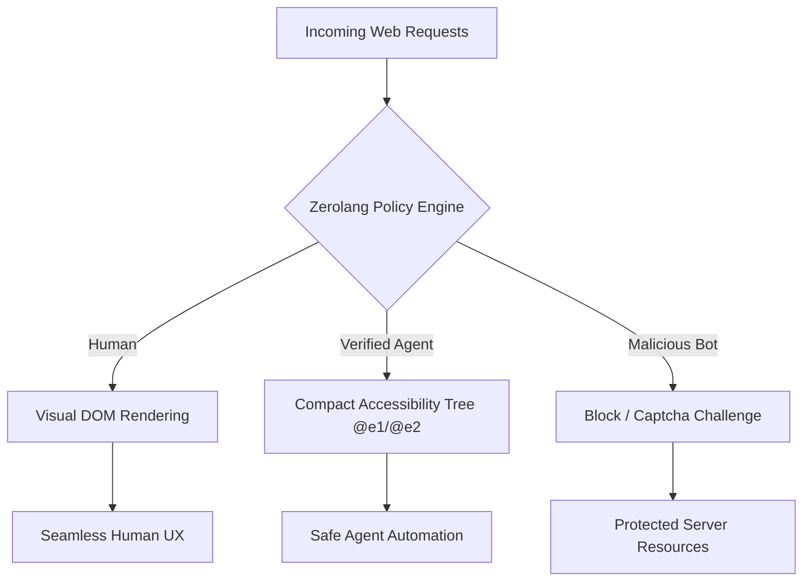

# But Are You A Human? — Agent-Safe but Abuse-Resistant UX Playground

**"But Are You A Human?"** is an interactive browser-based dashboard and policy testing playground. It helps developers test, simulate, and design web policies that allow **AI Agents** (using `agent-browser` accessibility tree mappings) to run visual web transactions without becoming an open vector for **malicious bot abuse**.

In a future where autonomous agents buy concert tickets, fill SaaS forms, and scrape listings, websites need a new architectural tier: **Agent-Safe but Abuse-Resistant UX**. 

---

##  Key Highlights & Features

1. **Simulated Zerolang Policy Engine (`policy.0`)**: 
   - A live code editor where you write protection rules using **Zero**, Vercel's agent-first systems programming language.
   - Provides instant **JSON Compiler Diagnostics** in the log panel, matching Vercel's zero compiler warnings, errors, and static contract checks (e.g. tracking impure effects like `world.out.write` or missing `raises` statements).
   - Generates executable rules in real-time to intercept simulation events.

2. **Agent-Browser CLI Terminal Emulator**:
   - A terminal mimicking the `agent-browser` toolchain by Vercel Labs.
   - Run console commands:
     - `open <url>`: Navigates browser tabs.
     - `snapshot`: Renders the Accessibility Tree as seen by an AI LLM (compact text and unique ref tags like `@e1`, `@e2`).
     - `click <@ref>`: Interacts deterministically with elements.
     - `fill <@ref> <value>`: Types textual data.

3. **Interactive Visual Web Scenarios**:
   - **Ticket Booking / Seat Scalping**: Protect seat sales against rapid bot scalping. Verified agents using cryptographic key signatures bypass standard human CAPTCHAs, but are strictly throttled.
   - **SaaS Signup Portal**: Avoid spam trial signups. Emulates agents validating credentials via decentralized identifiers (DIDs) or API keys.
   - **Data Scraping rate blocks**: Defend visual servers against aggressive database scrapers. Policies direct AI agents to `/polite-agent-feed` while rate-limiting standard visual scrapers.

4. **Real-time Traffic Simulator & Security Analytics**:
   - Hit **"Start Traffic"** to generate periodic concurrent requests representing **Humans**, **Verified Agents**, and **Malicious Bots** hitting your policy.
   - Renders live dashboards tracking:
     - **Human UX Friction Factor**: The captcha overhead humans have to endure due to overly strict or porous policies.
     - **Agent Transaction Success Rate**: How successfully productive agents complete goals.
     - **Malicious Bot Block Rate**: Ratio of blocked automated attack scripts.

---

##  How to Run Locally

### Prerequisites
- Node.js (v18 or higher)
- npm (v9 or higher)

### Installation
1. Clone the repository and navigate to the project root:
   ```bash
   git clone https://github.com/your-username/but-are-you-a-human.git
   cd but-are-you-a-human
   ```

2. Install dependencies:
   ```bash
   npm install --legacy-peer-deps
   ```
   *(Note: `--legacy-peer-deps` is recommended due to peer resolutions on modern Vite 8 environments).*

3. Launch the local dev server:
   ```bash
   npm run dev
   ```

4. Open the browser link (usually `http://localhost:5173`) and start playing!

---

##  Writing Zerolang Policies (`policy.0`)

Write policy checks directly inside the active editor using Zerolang's explicit systems logic. Below is a sample policy that restricts bots, protects booking, and validates cryptographic credentials:

```rust
pub fun check_policy(flow: String, user_type: String, rate: i32, verified_agent: bool) -> bool raises {
    // Ticket Booking check
    if flow == "booking" {
        if user_type == "agent" {
            // Block unverified AI agents
            if !verified_agent {
                return false
            }
            // Strict rate limit of 2 checkout attempts
            if rate > 2 {
                return false
            }
        }
    }

    // SaaS Signup protection
    if flow == "signup" {
        if user_type == "agent" {
            if !verified_agent {
                return false
            }
            if rate > 1 {
                return false
            }
        }
    }

    // Scraper rate restriction
    if flow == "scraping" {
        if user_type == "bot" {
            return false // Instant block
        }
    }

    return true
}
```

---

##  Architectural Visual



---

## 📜 Licensing

Distributed under the Apache-2.0 License. See `LICENSE` for details.
