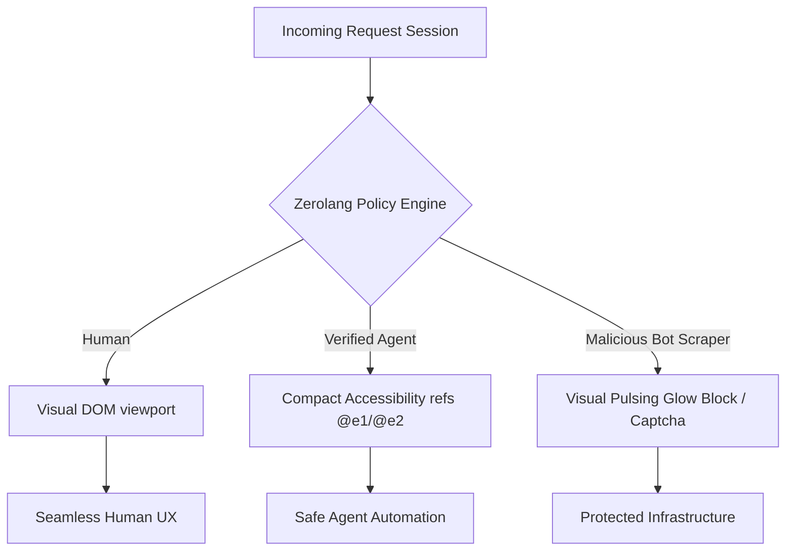

# But Are You A Human? — Agent-Safe but Abuse-Resistant UX Playground

**"But Are You A Human?"** is an advanced interactive visual testing ground and web policy simulator. It helps developers research, model, and deploy server policies that allow **AI Agents** (using `agent-browser` accessibility tree mappings) to run web flows (ticket purchases, saas signups, fare searches) efficiently while shielding the Visual DOM from **malicious bot abuse**.

In a future where autonomous agents buy tickets, search flights, and register services, standard CAPTCHAs lock out useful AI enclaves. This playground models the modern solution: **Agent-Safe but Abuse-Resistant UX**.

---

## ⚡ Core Systems & Features

1. **Simulated Zerolang Compiler & Presets (`policy.0`)**:
   - Live code editor supporting **Zero** syntax (Vercel's agent-first systems programming language).
   - Generates **JSON Diagnostics logs** in real-time, checking for braces balance, side-effect declarations (`check`), and missing `raises` clauses.
   - Presets toolbar: Quick-load **🛡️ Balanced**, **🔓 Permissive**, or **🔒 Block All** templates instantly.
   - **🧪 Automated Regression Test Runner**: Run a 4-suite regression check against the compiler directly from the UI to verify parser integrity.

2. **Agent-Browser Terminal & Command Assertions**:
   - CLI terminal emulator mapping to the `agent-browser` toolchain by Vercel Labs.
   - Custom **Theme Selector Toggles** (Electric Cyan, Matrix Green, CRT Amber, Silicon White) with customized caret indicators.
   - Interactive keyboard ticks and synthesizer bells.
   - Console command assertion actions:
     - `assert.exists <@ref>`: Asserts node visibility.
     - `assert.contains <@ref> <value>`: Asserts element text content matches.
     - `assert.equals <@ref> <value>`: Asserts input form value equals text.

3. **Secure Vault Credentials Manager**:
   - Emulates browser enclave credential management via console CLI commands:
     - `vault.set <key> <value>`: Securely registers a secret.
     - `vault.list`: Inspects keys but redacts values under asterisks (`*********`).
   - Resolves secrets inside CLI actions dynamically: `agent-browser fill @e4 $API_KEY`.

4. **Visual Web Scenarios viewport**:
   - **🎫 Concert Ticket seat booking**: Seat allocations, booking checkouts, and threat CAPTCHAs.
   - **🚀 SaaS Account trial signup**: Cryptographic signature validation and account registries.
   - **📦 Apex Logistics Inventory listings**: Rate throttle safeguards and Polite JSON endpoints.
   - **✈️ SkySkip Flight search crawl (Scenario 4)**: pricing fare listings and travel agent query flows.
   - Toggles dynamically between standard **🌐 Visual DOM (Human view)** and **🦾 Accessibility Tree (Agent view)**.

5. **Security Analytics & Pulsing Glow Indicators**:
   - **"Start Traffic"** feeds periodic random sessions (Humans, Agents, Bots) hitting the policy.
   - Dashboard logs showing Human UX Friction (%), Agent Success Rate (%), and Bot Block Rate (%).
   - **💥 Attack bursts triggers**: Launch direct Bot credential-stuffing surges or Human spikes.
   - Pulsing glowing **neon threat frames** alert you during active bot surges.

---

## 🎹 Embedded Auditory Synth System

Uses the browser's native **Web Audio API Synthesizer** (generating direct sine/sawtooth sound sweeps completely from scratch) to provide high-fidelity auditory confirmation:
- **✓ Chime**: Double-tone success chime on clean compiles and authorized transacts.
- **❌ Buzz**: Low sawtooth rumble on blocked bot attacks or syntax warnings.
- **⚡ Sweep**: Frequency laser rise on starting simulation runs or active bot surges.

---

## 🎮 How to Launch and Test

1. Navigate to the project root:
   ```bash
   cd "d:\Project x"
   ```

2. Install dependencies:
   ```bash
   npm install --legacy-peer-deps
   ```

3. Launch the dev workspace:
   ```bash
   npm run dev
   ```

4. Load the output browser URL and explore the visual enclaves!

---

## 🏗️ Architectural Flow chart



---

## 📜 Licensing

Distributed under the Apache-2.0 License. See `LICENSE` for details.
All rights reserved © 2026.
